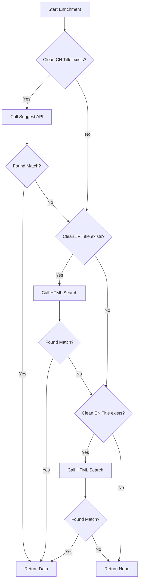

# Design: Multi-Stage Douban Search Strategy

## Architecture

The solution refactors `douban_api.py` to support a fallback chain and introduces HTML scraping capabilities.

### Search Flow

## Detailed Component Design

### 1. `douban_api.py` Refactoring

**Constants**
- `RATE_LIMIT_DELAY = 5.0` (Updated from 2.0 to match `CLAUDE.md`)

**New Function: `search_douban_html(query: str, year: int) -> Optional[Dict]`**
- **URL**: `https://www.douban.com/search?cat=1002&q={query}`
- **Headers**: User-Agent matching standard browsers.
- **Parsing Logic (BeautifulSoup)**:
    - Selector: `div.result` (Iterate through **top 3** items).
    - Title: `div.content > div.title > h3 > a` (Extract text).
    - Rating: `div.content > div.rating-info > span.rating_nums` (Extract text).
    - Year: Parse from title text or metadata line (e.g., "Sōsō no Frieren (2023)").
    - **Year Matching**: Must be within `target_year ± 1`.
- **Error Handling**: Catch `requests.exceptions.RequestException`, `AttributeError` (parsing failures), and handle HTTP 429/403/500 gracefully.

**Updated Function: `search_douban(titles: Dict[str, str], year: int)`**
- **Signature Change**: Accepts a dictionary of titles: `{'cn': ..., 'jp': ..., 'en': ...}`.
- **Logic**: Implements the fallback chain defined in the flowchart.
- **Input Validation**: `clean_cn`, `clean_jp`, `clean_en` are checked for non-empty strings before use.

### 2. `cross_platform.py` Integration

- Update the loop in `enrich_anime` to construct the `titles` dictionary.
- Pass `titleOriginal` as `jp` and `titleEnglish` as `en`.
- **Pre-condition**: Ensure `titleEnglish` exists in the record (fallback to empty string if missing).

## Validation Strategy
- **Success Metric**: Coverage = (Total Matches / Total Anime with JP Title) > 80%.
- **Test Set**: Use the provided 5 "Hard" cases in `tasks.md` to verify the fix works for previously failed entries.

## Constraints & Risks
- **Rate Limiting**: Strictly enforce 5s delay. If 429 is received, back off for 60s.
- **False Positives**: Searching by English title (e.g., "Monster") is risky. Year validation is the primary guardrail.
- **Category 1002**: This generally covers Movies and TV series. OVAs are usually included, but edge cases might exist. We accept this trade-off for now.